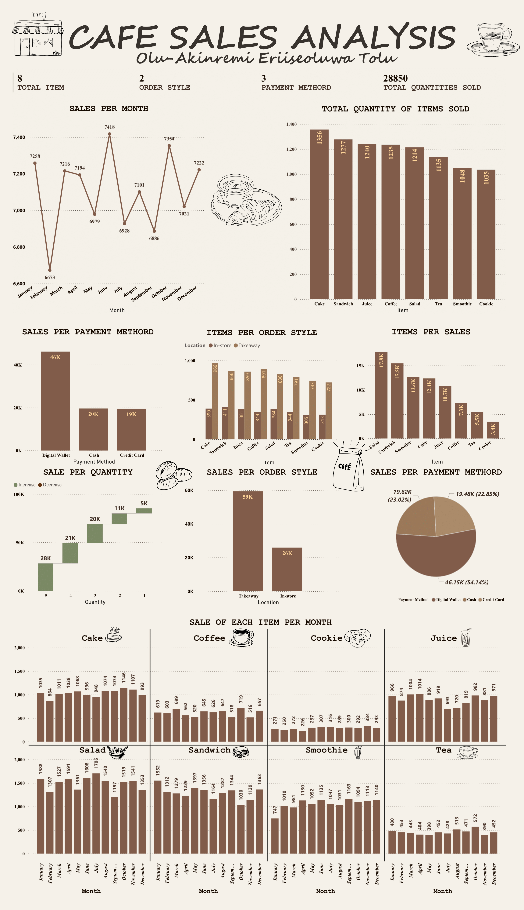

# Café Sales Performance Analysis

Tags: Customer Behavior, Food & Beverage, Hospitality, Sales Analytics
Tools Used: POWERBI, SQL
Date: July 7, 2025 → July 14, 2025
Project Overview: This project looked at a café’s sales over a year to understand what products sell best, when customers come in, and how they prefer to pay. The café didn’t have a clear picture of these trends, which made it hard to plan inventory, promotions, or marketing.

My task was to analyze the data and uncover patterns in revenue, customer behavior, and product performance. The insights were then used to make practical recommendations like boosting popular items, creating promotions, and improving convenience to help the café increase sales and keep customers happy.
Business problem/Problem Statement: The café didn’t know which products were making the most money, when customers came in, or how they preferred to pay. Without these insights, managing inventory, marketing, and promotions was guesswork.
Questions the café team wanted answered:
• Which menu items drive the most revenue?
• When do customers visit the most?
• Do they prefer takeaway or dine-in?
• How do payment methods impact sales?
• What order sizes bring in the most revenue?
Description of Approach: To help the café understand its sales patterns and make smarter business decisions, I followed these steps:
1. Collected the Data: Gathered 12 months of sales records, including items sold, order size, payment method, and whether the order was dine-in or takeaway.
2. Cleaned the Data: Checked for missing or inconsistent entries, fixed errors, and made sure all dates, prices, and item names were consistent.
3. Explored the Data: Looked for trends—like which items sold the most, which months had lower revenue, and which payment methods customers preferred.
4. Analyzed the Data: Used Excel and Power BI to create visualizations showing revenue trends, top-selling products, customer behavior, and order patterns.
5. Faced Challenges: Some sales categories were unclear, and grouping similar items (like coffee drinks) was necessary to avoid misleading results.
6. Generated Insights: Identified top products, peak sales periods, preferred payment methods, and opportunities to increase revenue through combos and promotions.
7. Made Recommendations: Suggested actionable steps, like promoting healthy bundles, boosting coffee sales with combos, offering discounts for large orders, and creating a loyalty program for mobile wallet users.
Files & media: CAFE_SALES_ANALYSIS.pdf
Status: Done
Created: August 10, 2024 12:09 PM

## ☕ **Key Insights**

1. **April slump:** Revenue dipped to ₦6.67K Revenue remained stable across the year with minor fluctuations. However, **April saw the lowest sales (₦6.67K)**
2. **Healthy Items :** **Salad (₦17.8K)** and **Sandwiches (₦15.5K)** brought in the highest revenue. Customers are clearly leaning toward **healthy, fast-grab options**
3. **69% of all sales** came from takeaway orders. This confirms that customers prefer **convenience** over dine-in experience. The café should prioritize pickup flow and improve pre-order options.
4. **54% of total revenue** came from digital wallets. Cash and credit card payments lag behind (both at 23%).  The café is dealing with a LOT **mobile-first audience**
5. Orders with 5 items accounted for ₦28K+, far more than smaller orders. The pattern is clear: **bigger orders bring in better returns.** Bundling and discounts for group purchases can unlock even more revenue.
6. Coffee sales came in at only **₦7.3K**, far behind other items.
7. Cookies and tea were the lowest sellers, but not necessarily unpopular.

## RECOMMENDATIONS

- **April Sales Dip:** Launch “Spring-Brew” Easter promo
- **Boost Coffee Sales:** Create combos like “Cake + Cappuccino”
- **Promote Healthy Bundles:** Pair Salad + Smoothie
- **Encourage Large Orders:** Offer “Café Crew Pack” (Buy 5, Get Discount)
- **Reward Loyalty:** Implement mobile wallet stamp card (Buy 9, get 1 free)